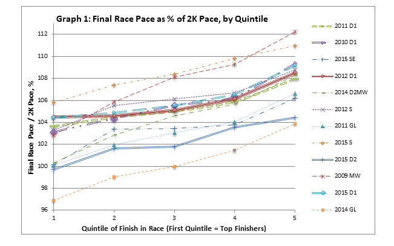
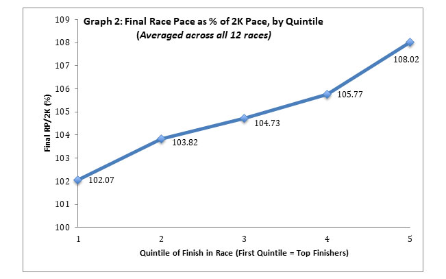
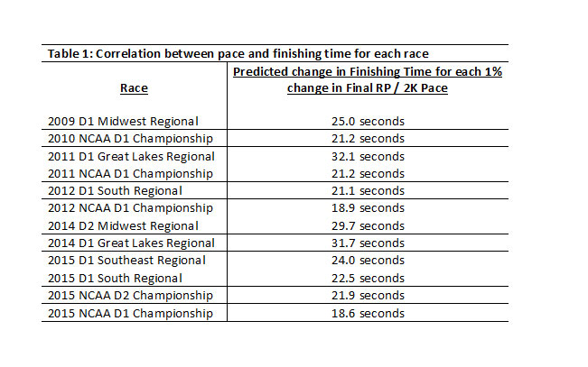

# Data Science Reflections

http://www.ustfccca.org/2017/08/featured/pacing-strategy-can-analytics-help-us-run-faster-in-cross-country

09/08/2020:
My Data Science Reflection is investigating the analytics surrounding pacing strategies in high-level collegiate cross-country races and how these strategies could affect overall finishing time. There is a very strong relationship between pacing strategy and finishing time, but the article I based my reflection on proves that, typically, the runners in these high-level collegiate cross-country races tend not to follow the best pacing strategies. Running more evenly paced results in faster racing times, yet it most common that these runners start out faster than their finishing pace. 

Results from twelve NCAA cross-country 10,000m national or regional races were analyzed by race pace as a percentage of two-kilometer pace. The runners from the twelve analyzed, high-level collegiate races were then divided up into five quintiles based on their finishing position in the race (first quintile = top finishers). Then, the final race pace divided by the opening two-kilometer pace created a percentage that could numerically demonstrate how the runners of each quintile adjusted their pace from their opening split. Based on the data, it was very clear that those who slowed the least were the top runners. That’s a very simple concept to understand, but the article’s data really illustrated how much of an impact it can have on finishing time.

On the track & field side of things, predictive analytics is beginning to see use to predict the finshing place of runners based on their split times. These predictive models are more accurate than seed-time or any other predictor. I believe that technology could be created to predict a runner's finishing time and place live based on how their pace has advanced through a race.

