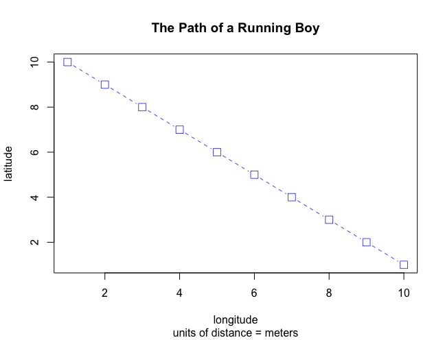

# Creating and Plotting Objects

08/21/2020: I created my first script in RStudio by following the steps given in Professor Frazier's "Getting Started with R & RStudio!" It was very fun to create a line plot in R and I look forward to learning how to create some of my own with differnet data. Some of the steps were a bit difficult to follow at first, but I think I mostly understand the basics now.

