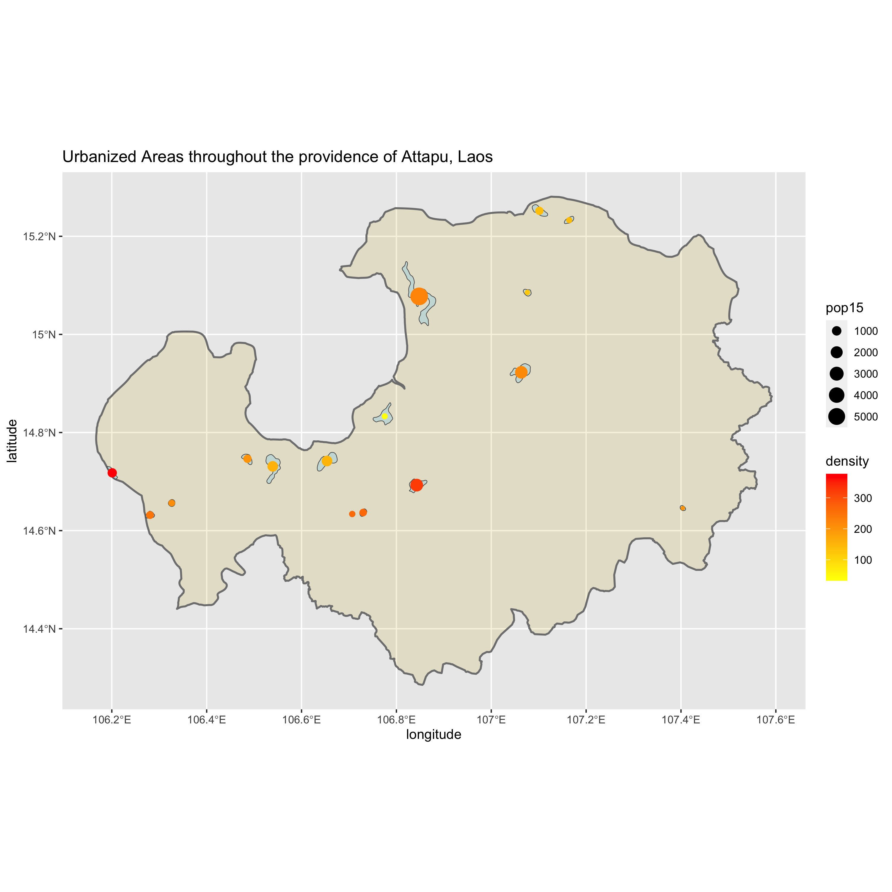

# Final Project

This plot is of all the urbanized areas throughout Attapu, Laos. The legend on the side describes their population count and their density. Attapu is an ADM1 I chose, becasue there were very few ADM2s that would have fit the outline.

Another plot of Attapu, Laos, this plot details the urban areas, roads, and healthcare locations within the county. Secondary roads were listed as the only type through Attapu and they're drawn in orange. The blue spots are hospitals (2), the purple spots are clinics (2), and other healthcare facilities are green (5). 

This final deliverable is a three-dimensional topographic plot of Attapu with the urban areas, roads, and healthcare facilities detailed. Additionally, the primary urban area of the county, Attapeu, is labeled. I enjoyed making three-dimensional plots!
