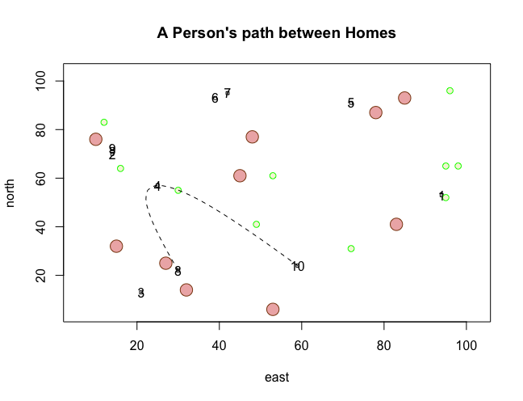

# Creating a More Complicated Plot

08/24/2020: This plot was not too bad to create, surprisingly. I tried to type out all the commands manually in order to gain experience typing the code, but, for sure reason, not all ten points would appear on the plot as if the axes weren't labeled to go long enough to accomodate the points further out (despite the lengths being the same). All of the commands were the same, so I couldn't figure out why that was happening, but, once I copied Professor Frazier's commands instead, it worked out. I'm going to spend some time this weekend testing out the code to see if I can figure out how to remove the number labels from every point and other little clean-up items like that.
