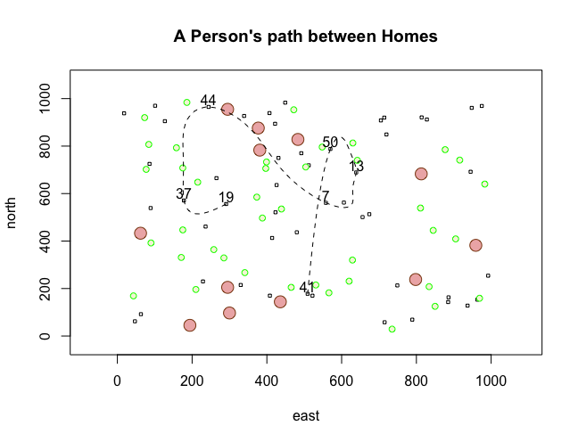

# Challenge Question

08/27/2020: This Challenge Question was surprisingly not too difficult! Once I looked back at the code from the the More Complicated Plot, I was able to understand what the numbers represented and manipulate them to create the plot of the Challenge Question. I had trouble with labeling only the seven points, but, after help from some of my peers in a breakout room, I figured out that I needed to add the text code after I created the locations. Starting to feel a bit more confident with RStudio.
