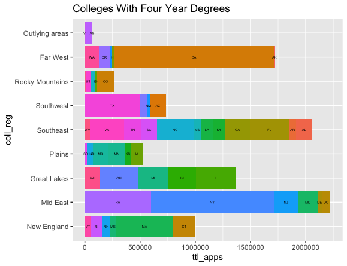
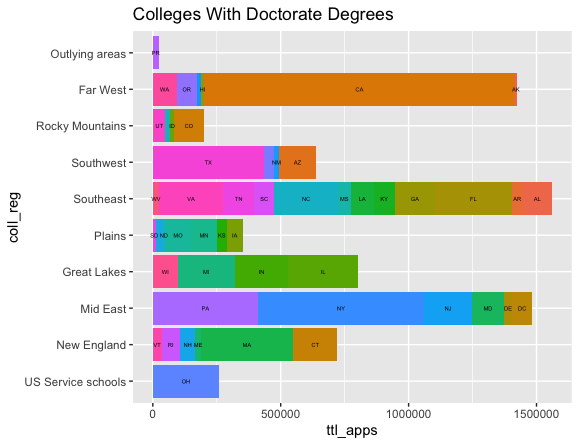
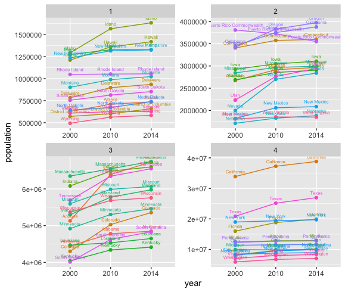

# Lab One - Parts One and Two

PART ONE:

  >data_mgt_pt2:

09/08/2020: Okay, this second section of part one of this lab was a lot more difficult (as shown by the much more complicated plot). There were a lot more figure-out-the-variable pieces to these instructions and I honestly don't know how I would've figured it out without Professor Frazier being generous enough to take the time to help on friday night. For me, sometimes the difficult part is just figuring out what variables/commands it says you have to create yourself and which are the actual code you use. However, I feel good having made it through this tougher part (even with lots of help) and I think having this lab to look back to should help in the future if I encounter another similarly-difficult bar plot lab.

PART TWO:

  >fundamentals_pt1
  

09/13/2020: The second part to this lab was smooth sailing for me! I was a bit behind on the second piece of part one (I couldn't figure out how to title properly and I had some export issues), but that wasn't too much of an issue. This felt like a much smoother, cleaner script and it felt very clear what I was doing. I was able to get some of the script from others who had questions with their's but I would just use it if I got stuck so I didn't have to turn to Slack everytime there was an issue! I think the plots look totally cool and I'm feeling caught up and ready to take on Lab Two! Edit: actually, my data was out of order, but I figured out how to fix that!
