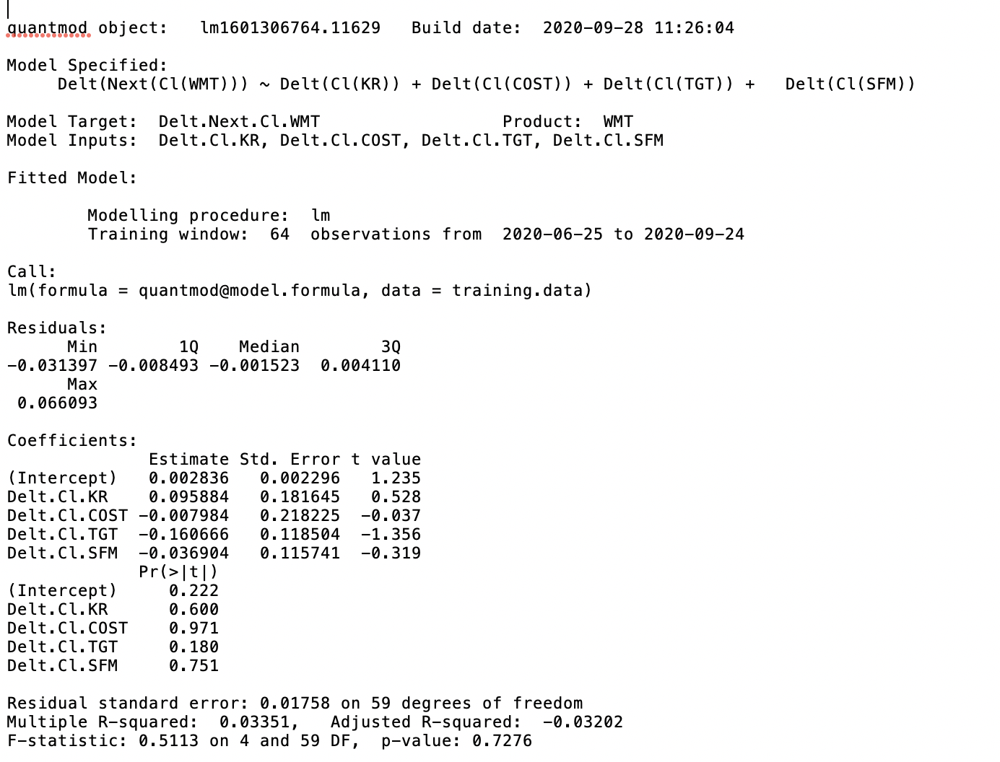

# Lab Two - Part One and Two

PART ONE:

09/20/2020: This lab was a huge step! I didn't have pictures of anyone's code progress on this to take to when I got stuck, but I did have my own code from Project 1 that was very similar. However, being able to understand how to tweak that code for this particular project and gain a more concrete understanding of what the commands accomplish, etc, really shows growth! Creating the first deliverable was quite easy, but I struggled a bit with creating the equation to find growth rate. However, once I did get help from Professor Frazier, it made sense and I'll be able to look back at that just as I looked back at Project One. Looking forward to the rest and I hope it stays managable!

PART TWO:

09/27/2020: This was a solid part two! I just followed the steps from the pdf file and I didn't really run into any issues. To produce the deliverable with my own stocks, I just replaced every occurance of one stock name with my set replacement. It was cool to use a sink file! I just had a little trouble figuring out how to make it presentable here on GitHub, but using the command is pretty simple.
