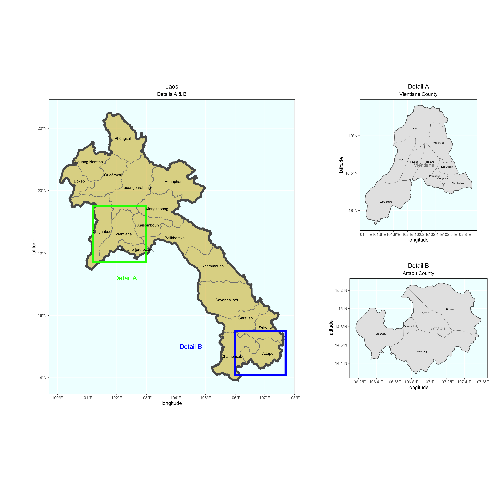

# Lab Three - Part One, Two

10/09/2020: This is a plot of the country Laos, a country in Southeast Asia, and all of the country's counties and subdivisions. This plot was pretty easy to make! I think I got it within the first couple attempts and then I just played around with the colors so that they matched the Laos national flag. It's really good to see such a complex plot like this start to become so simply (even if most of the credit goes to the data and not my code).

10/13/2020: This second plot is of Vientiane, the most populus county in Laos, which is also the capital city of Laos. This plot wasn't too much more difficult than the first, but I was stuck when I was trying to add the title of the county (Vientiane) onto the plot. It turns out I had made a couple errors that, while still allowing me to label the subregions, prevented me from being able to label the county over those. Once I made some changes that made it look more like the original code, it worked after adding an additional "geom_sf_text."

10/17/2020: This third plot is of Laos, but zoomed in on Vientiane and Attapu. Vientiane is the most populus county in Laos and Attapu is the least populus county in Laos. I had lot of trouble with the boxes and labeling the boxes, but, otherwise, it was basically just a combination of the first two plots.
