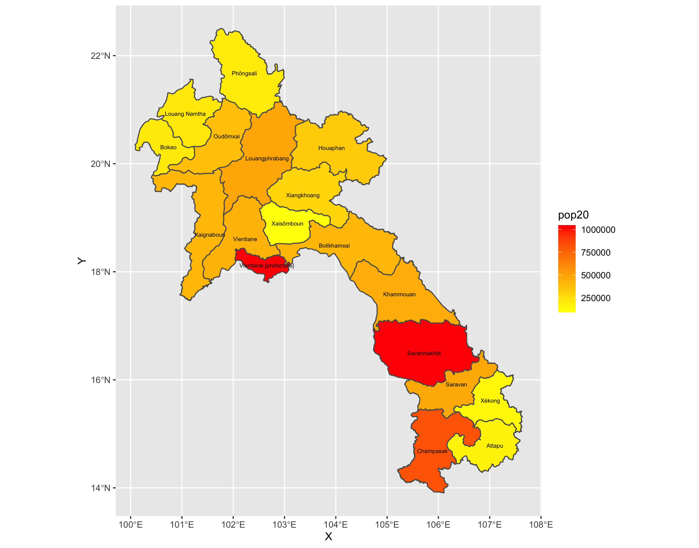
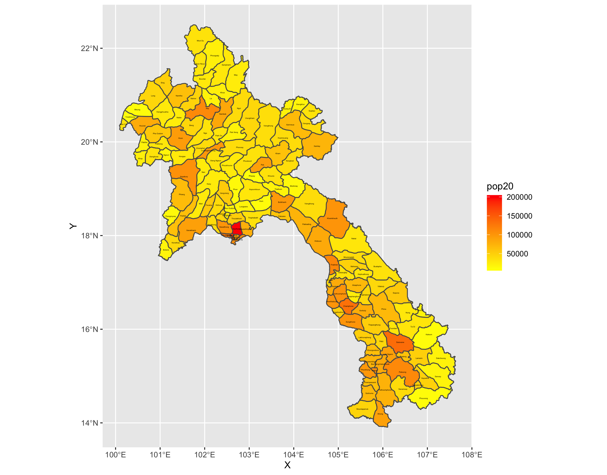
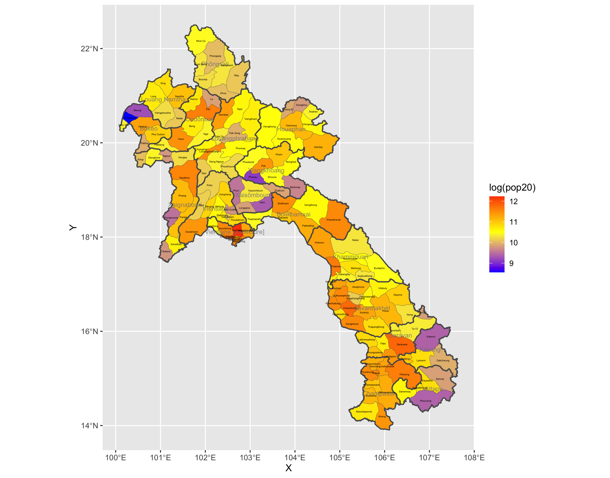
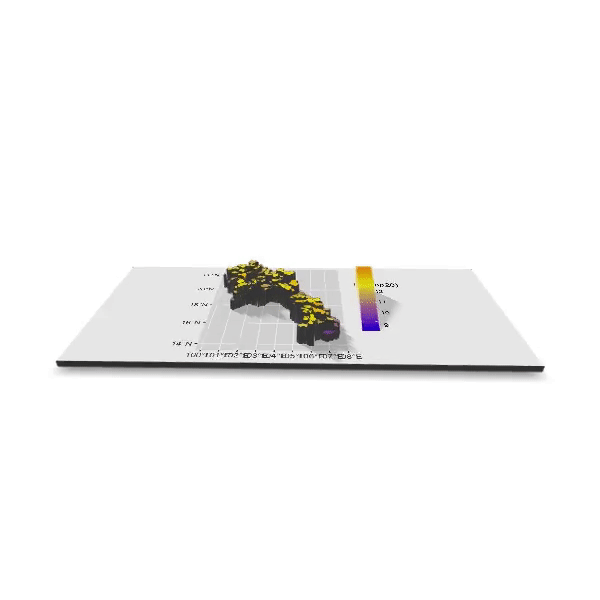
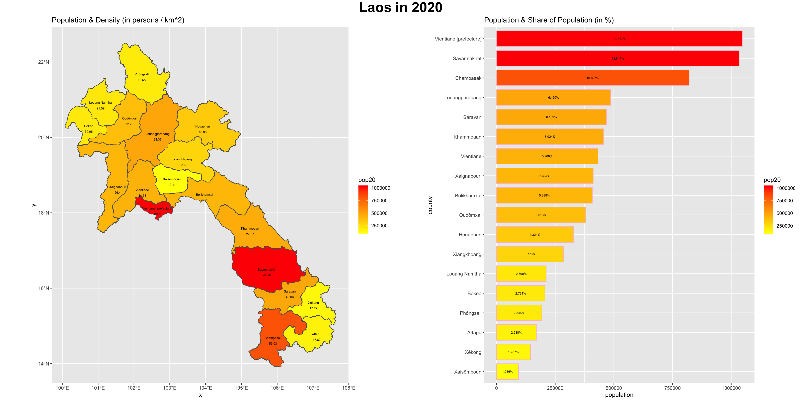
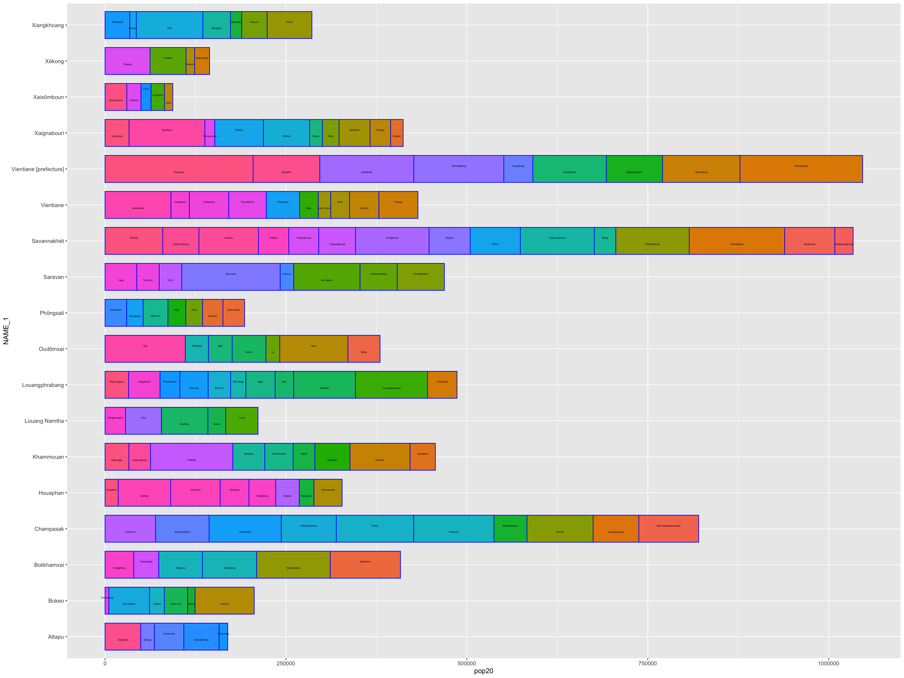

# Lab Four - Parts One, Two

This plot is of Laos divided into counties. There is a color gradiant to display the number of individuals within each county. This plot was pretty easy to produce! I'm a big fan of these colorful, descriptive plots.

This plot very similar to the first, however, Laos is divided into its subdivisions. The same color gradiant is applied, but the scale is much smaller since there would obviously be less individuals occupying a more-divided area. Similar to the first plot, I had no issues here!

This third plot is basically a combination of deliverables one & two with a slighly more complex scale and legend. Laos is divided into its subdivisions, but the boundaries of its counties are bolded. The scale has been condensed using a midpoint to make the difference in sizes more visible since they are much smaller than when comparing larger areas. I had a strange issue getting the borders of the counties to bold, but there was some issue with my data further up that I was able to fix for it. It was nice playing around with the transparency, color saturation, and border size.

This fourth deliverable is a three dimensional GIF of the third deliverable of this project. At first, it only produced a three dimensional picture I could rotate, but with some more code I was able to create a mp4 movie out of it and then ultimately convert it into a GIF. Besides figuring out the code I needed, this part wasn't very difficult at all so I'll definitely take advantage of this trick in the future if I would ever benefit from a three dimensional model!

Part two of this project involved bar plots and this first deliverable is a combination of a typical plot and a bar plot. The plot of Laos is of the country's counties with each county's respective population density (# of persons per km^2) listed under the county name. Again, there is a gradiant scale to explain the number of individuals within the county. On the right side, there is a bar plot that displays the population size of each county with the percentage that communicates that county's share of Laos' total population. Very cool to produce such a descriptive plot and bar plot side-by-side!

